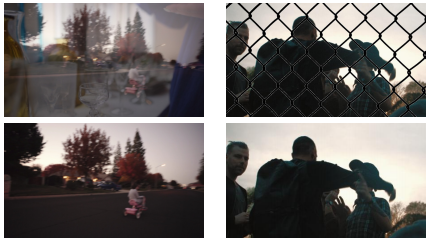

# obstruction-removal
<ul>
<li>Checkout the project manuscript above - Obstruction.pdf</li> 
<li></li>
<li>The Repo consists of 4 folders - 
&emsp;1 for data creation from images in .jpg format to .npy format for the model to be able to use them as input for training. 
&emsp;3 folders, each contain the code for each of the 3 layers (i) Initial layer Construction, (ii) Predictor-Flow Improvisation and (iii) Feature Corrector</li> 

<li>The dataset for the model can be downloaded from these links - https://drive.google.com/file/d/1Pf2WxCBqBLdfAi2gdV9I-_Y479aXTVZU/view?usp=sharing. Copy the contents of the .zip file in a folder called data.</li> 

<li>You can find the link for the raw dataset here - https://drive.google.com/drive/folders/1j6o5sdlTpGyX1u2z0cifLsr5rzpKFBQp?usp=sharing</li> 

<li>If you want to create and train the model on your own dataset, the structure of your dataset should look like this(please see the above raw dataset for example -  
------------- Fencing 
&emsp;&emsp;------------- 0/1/2/3...(folder name, training example) 
&emsp;&emsp;&emsp;&emsp;------------- mixed(contains 7 frames) 
&emsp;&emsp;&emsp;&emsp;&emsp;&emsp;------------- 0.jpg/1.jpg...(frame containing the image to be cleaned, 896x512) 
&emsp;&emsp;&emsp;&emsp;------------- vid1(contains 7 frames) 
&emsp;&emsp;&emsp;&emsp;&emsp;&emsp;------------- 0.jpg/1.jpg...(frame containing the background image(whether reflection or fencing), 896x512)       &emsp;&emsp;&emsp;&emsp;------------- vid2(contains 7 frames) 
&emsp;&emsp;&emsp;&emsp;&emsp;&emsp;------------- 0.jpg/1.jpg...(frame containing the foreground image(whether reflection or fences, depending on the problem), 896x512) </li> 

<li>The model has to be trained end-to-end and the pre-trained model cannot be provided at this time due their large size.</li> 
